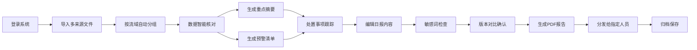

# 防汛值班日报自动化工具 产品需求文档

## 1. 产品概述

防汛值班日报自动化工具是为水利局值班室量身打造的一体化办公平台，旨在解决每日防汛信息汇总繁琐、数据核对易错、报告生成耗时等痛点。系统整合资料导入、数据智能核对、重点信息提取、预警监控、处置跟踪、报告编辑及分发归档七大核心模块，实现防汛值班工作的数字化、智能化、规范化管理。

目标用户：水利局值班室工作人员、防汛指挥人员、相关领导
核心价值：提升日报编制效率80%以上，确保数据准确性，强化防汛处置跟踪能力

## 2. 核心功能

### 2.1 用户角色

| 角色 | 注册方式 | 核心权限 |
|------|----------|----------|
| 值班员 | 系统分配账号 | 资料导入、数据核对、日报编辑、生成PDF |
| 值班长 | 系统分配账号 | 审核日报、发布预警、查看处置跟踪 |
| 领导 | 系统分配账号 | 查看日报、插入批示、查看统计分析 |
| 管理员 | 系统分配账号 | 用户管理、系统配置、归档查询 |

### 2.2 功能模块

1. **资料导入模块**：支持多来源文件导入（Excel、CSV、Word、图片）、按流域自动分组、数据预览和校验
2. **数据核对模块**：自动提取最大雨量、超警水位标记、病险水库识别、泵站排涝量汇总、异常数据高亮
3. **重点摘要模块**：自动生成值班要情、关键指标仪表盘、按流域统计汇总、数据趋势图表
4. **预警清单模块**：超警站点清单、雨量预警、水位预警、病险水库预警、预警级别标识
5. **处置跟踪模块**：处置事项登记、责任人分配、进度跟踪、超时预警、处置闭环管理
6. **日报编辑模块**：模板化报告生成、领导批示插入、手工修订、敏感词检查、版本对比
7. **分发归档模块**：PDF生成、指定人员发送、附件整理、定时提醒、归档查询、历史版本回溯

### 2.3 页面详情

| 页面名称 | 模块名称 | 功能描述 |
|----------|----------|----------|
| 首页仪表盘 | 综合概览 | 今日雨情水情总览、预警数量统计、待处置事项、快捷操作入口 |
| 资料导入页 | 资料导入 | 文件上传区域、文件列表、导入进度、数据预览、流域映射配置 |
| 数据核对页 | 数据核对 | 雨量数据表、水位数据表、水库信息表、泵站统计表、异常标记 |
| 重点摘要页 | 重点摘要 | 值班要情自动生成、最大雨量排名、超警水位列表、流域统计图 |
| 预警清单页 | 预警清单 | 分级预警列表、预警详情、预警处置关联、预警解除操作 |
| 处置跟踪页 | 处置跟踪 | 处置事项列表、进度追踪、责任人管理、超时提醒、完成确认 |
| 日报编辑页 | 日报编辑 | 富文本编辑器、模板选择、敏感词检测、版本管理、领导批示区 |
| 分发归档页 | 分发归档 | PDF预览、发送人员选择、附件管理、归档记录、历史查询 |
| 系统设置页 | 系统管理 | 用户管理、流域配置、预警阈值、敏感词库、提醒设置 |

## 3. 核心流程

### 3.1 日报编制主流程

值班员登录系统 → 导入多来源数据文件 → 系统自动解析并按流域分组 → 数据智能核对（标记异常）→ 自动生成重点摘要和预警清单 → 录入/跟踪处置事项 → 编辑日报内容（插入领导批示）→ 敏感词检查和版本对比 → 生成PDF → 分发给指定人员 → 归档保存

## 4. 用户界面设计

### 4.1 设计风格

- **主色调**：深邃藏蓝 (#0F3460) 代表专业、可靠、稳重，搭配天蓝色 (#1687A7) 作为辅助色
- **强调色**：预警红 (#E94560)、提醒橙 (#FF9F45)、成功绿 (#27AE60)
- **中性色**：白色背景 (#FFFFFF)、浅灰分隔 (#F5F7FA)、深灰文字 (#333333)
- **按钮风格**：圆角矩形（8px），悬停有微妙阴影和颜色加深效果
- **字体**：标题使用 "Noto Sans SC" 加粗，正文使用 "PingFang SC" 或系统无衬线字体
- **布局风格**：顶部导航栏 + 左侧菜单 + 内容区域三栏布局，卡片式模块划分
- **图标风格**：线性图标为主，预警类使用填充图标增强视觉冲击

### 4.2 页面设计概述

| 页面名称 | 模块名称 | UI元素 |
|----------|----------|--------|
| 首页仪表盘 | 综合概览 | 数据卡片网格、统计图表、预警列表、快捷操作按钮、渐变背景 |
| 资料导入页 | 资料导入 | 拖拽上传区域、文件进度条、数据预览表格、流域映射下拉框 |
| 数据核对页 | 数据核对 | 多标签数据表格、异常行高亮标记、筛选器、批量操作按钮 |
| 重点摘要页 | 重点摘要 | 值班要情卡片、排名列表、柱状图/折线图、流域切换标签 |
| 预警清单页 | 预警清单 | 分级卡片列表、色标标识、详情展开面板、处置快捷入口 |
| 处置跟踪页 | 处置跟踪 | 时间线进度展示、责任人头像、状态标签、操作按钮组 |
| 日报编辑页 | 日报编辑 | 富文本工具栏、分栏布局、侧边预览、版本切换下拉框 |
| 分发归档页 | 分发归档 | PDF预览窗口、人员选择树、附件缩略图、归档时间轴 |

### 4.3 响应式

- 采用桌面优先设计，主工作台适配1920×1080分辨率
- 侧边栏可折叠，适配1366×768等中小屏幕
- 关键数据模块支持平板端横屏查看
- 预警提醒推送支持移动端消息通知

### 4.4 动效设计

- 页面加载采用渐进式淡入，数据卡片依次浮现
- 表格行悬停有背景色过渡动画
- 预警图标有呼吸灯效果提醒关注
- 模态框采用缩放+淡入的组合动画
- 进度条采用平滑填充动画
