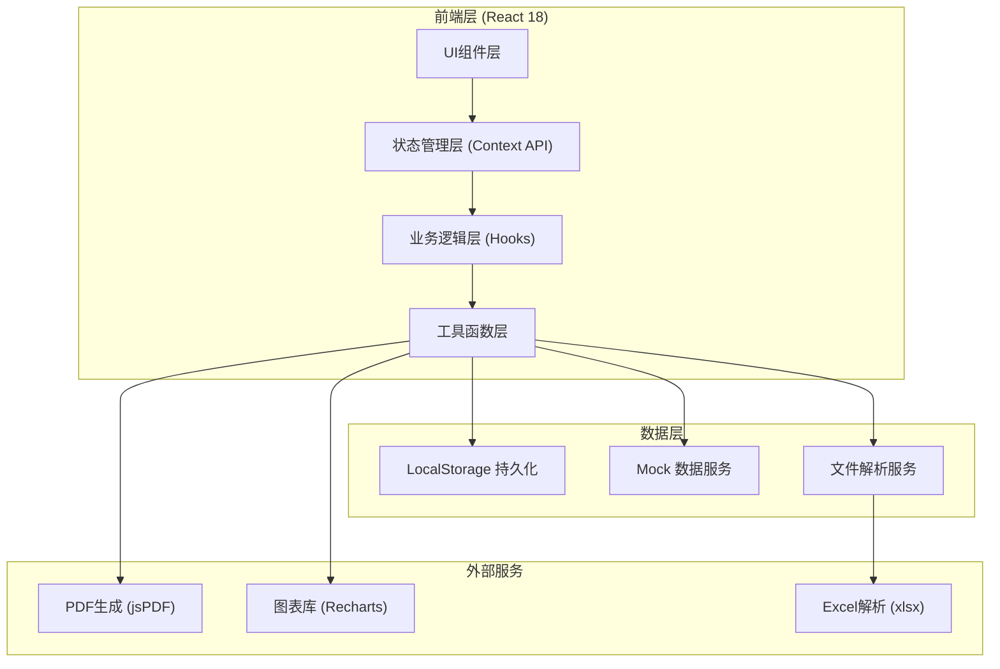

# 防汛值班日报自动化工具 技术架构文档

## 1. 架构设计



## 2. 技术选型说明

### 2.1 核心技术栈
- **前端框架**: React@18.2.0 - 组件化开发，生态成熟
- **构建工具**: Vite@5.0.0 - 快速冷启动，热更新高效
- **样式方案**: TailwindCSS@3.4.0 - 原子化CSS，开发效率高
- **语言**: TypeScript@5.3.0 - 类型安全，减少运行时错误
- **路由**: React Router DOM@6.20.0 - 单页路由管理
- **图标**: Lucide React@0.294.0 - 轻量现代图标库

### 2.2 关键功能库
- **文件解析**: xlsx@0.18.5 - Excel/CSV文件解析
- **PDF生成**: jspdf@2.5.1 + html2canvas@1.4.1 - 前端PDF导出
- **图表展示**: recharts@2.10.3 - React图表库
- **富文本编辑**: react-quill@2.0.0 - 富文本编辑器
- **时间处理**: dayjs@1.11.10 - 轻量时间处理库

### 2.3 无后端方案说明
采用纯前端架构，数据通过LocalStorage持久化存储，内置Mock数据演示功能。用户可导入本地Excel/CSV文件进行数据处理，所有计算逻辑在前端完成，无需服务器支持，部署简单，数据安全。

## 3. 路由定义

| 路由路径 | 页面名称 | 功能说明 |
|----------|----------|----------|
| `/` | 首页仪表盘 | 防汛数据总览、快捷操作入口 |
| `/import` | 资料导入 | 多来源文件上传、数据预览、流域映射 |
| `/verify` | 数据核对 | 雨量/水位/水库/泵站数据核对、异常标记 |
| `/summary` | 重点摘要 | 值班要情、统计图表、流域汇总 |
| `/warning` | 预警清单 | 分级预警列表、预警详情、处置关联 |
| `/disposal` | 处置跟踪 | 处置事项、进度跟踪、责任人管理 |
| `/report` | 日报编辑 | 报告生成、富文本编辑、敏感词检查 |
| `/archive` | 分发归档 | PDF生成、发送、归档查询 |
| `/settings` | 系统设置 | 参数配置、用户管理、阈值设置 |

## 4. 数据模型定义

### 4.1 核心数据类型

```typescript
// 雨量站点数据
interface RainfallStation {
  id: string;
  name: string;
  basin: string;      // 所属流域
  rainfall: number;   // 累计雨量(mm)
  oneHourRain: number; // 1小时雨量
  warningLevel: 'normal' | 'attention' | 'warning' | 'emergency';
  updateTime: string;
}

// 水位站点数据
interface WaterLevelStation {
  id: string;
  name: string;
  basin: string;
  currentLevel: number;  // 当前水位(m)
  warningLevel: number;  // 警戒水位(m)
  isOverWarning: boolean;
  trend: 'rising' | 'falling' | 'stable';
  updateTime: string;
}

// 水库数据
interface Reservoir {
  id: string;
  name: string;
  basin: string;
  isDangerous: boolean;  // 是否病险水库
  currentLevel: number;
  maxLevel: number;
  storage: number;       // 当前库容(万m³)
  outflow: number;       // 下泄流量(m³/s)
  updateTime: string;
}

// 泵站数据
interface PumpStation {
  id: string;
  name: string;
  basin: string;
  runningCount: number;  // 运行台数
  totalCapacity: number; // 总排涝能力
  drainageVolume: number; // 累计排涝量(万m³)
  updateTime: string;
}

// 预警事项
interface WarningItem {
  id: string;
  type: 'rainfall' | 'waterLevel' | 'reservoir' | 'other';
  level: 'blue' | 'yellow' | 'orange' | 'red';
  title: string;
  description: string;
  location: string;
  createTime: string;
  isHandled: boolean;
  handleTime?: string;
}

// 处置事项
interface DisposalItem {
  id: string;
  title: string;
  description: string;
  relatedWarningId?: string;
  personInCharge: string;
  status: 'pending' | 'processing' | 'completed' | 'delayed';
  progress: number;
  createTime: string;
  deadline: string;
  remarks: string[];
}

// 日报文档
interface DailyReport {
  id: string;
  date: string;
  title: string;
  content: string;
  leaderComments: string;
  versions: ReportVersion[];
  status: 'draft' | 'reviewing' | 'finalized' | 'archived';
  createTime: string;
  updateTime: string;
  creator: string;
}

// 报告版本
interface ReportVersion {
  version: number;
  content: string;
  createTime: string;
  creator: string;
  changeLog: string;
}

// 系统配置
interface SystemConfig {
  basins: string[];           // 流域列表
  rainfallWarning: {
    attention: number;
    warning: number;
    emergency: number;
  };
  sensitiveWords: string[];   // 敏感词库
  reminderTime: string;       // 定时提醒时间
}
```

## 5. 目录结构

```
src/
├── components/          # 通用组件
│   ├── Layout/         # 布局组件
│   ├── DataTable/      # 数据表格
│   ├── WarningCard/    # 预警卡片
│   ├── StatCard/       # 统计卡片
│   └── common/         # 基础组件(按钮、弹窗等)
├── pages/              # 页面组件
│   ├── Dashboard/
│   ├── DataImport/
│   ├── DataVerify/
│   ├── Summary/
│   ├── WarningList/
│   ├── DisposalTrack/
│   ├── ReportEditor/
│   ├── Archive/
│   └── Settings/
├── hooks/              # 自定义Hooks
│   ├── useDataImport.ts
│   ├── useDataVerify.ts
│   ├── useWarning.ts
│   └── useReport.ts
├── store/              # 状态管理
│   ├── DataContext.tsx
│   ├── ReportContext.tsx
│   └── ConfigContext.tsx
├── utils/              # 工具函数
│   ├── fileParser.ts   # 文件解析
│   ├── pdfGenerator.ts # PDF生成
│   ├── sensitiveCheck.ts # 敏感词检查
│   ├── dataProcessor.ts # 数据处理
│   └── mockData.ts     # Mock数据
├── types/              # TypeScript类型定义
│   └── index.ts
├── styles/             # 全局样式
│   └── globals.css
├── App.tsx
├── main.tsx
└── router.tsx
```

## 6. 核心功能实现方案

### 6.1 多来源文件导入
- 使用 `xlsx` 库解析Excel/CSV文件
- 支持拖拽上传和点击上传
- 文件格式自动检测，数据预览
- 按列名自动映射到对应数据字段
- 流域自动识别或手动配置映射

### 6.2 数据智能核对
- 雨量数据按站点排序，自动提取最大雨量
- 水位数据与警戒值对比，超警自动标红
- 病险水库单独标记，高亮显示
- 泵站排涝量自动汇总统计
- 异常数据（缺失值、超出合理范围）自动标记

### 6.3 敏感词检查
- 内置敏感词库，支持自定义添加
- 实时检测报告内容
- 高亮显示敏感词位置
- 提供替换建议

### 6.4 版本对比
- 保存每次修改的版本快照
- 支持两个版本的内容差异对比
- 使用diff算法高亮显示增删内容

### 6.5 PDF生成
- 使用 `html2canvas` 将DOM转为图片
- 使用 `jsPDF` 生成PDF文档
- 支持自定义页眉页脚、页码
- 支持A4纸规格导出

## 7. 开发规范

### 7.1 编码规范
- 使用TypeScript严格模式
- 组件采用函数式组件 + Hooks
- 文件名使用PascalCase（组件）或camelCase（工具函数）
- 统一使用ESLint + Prettier格式化

### 7.2 性能优化
- 数据量大的表格使用虚拟滚动
- 图表组件按需渲染
- 文件分片处理，避免主线程阻塞
- 使用React.memo避免不必要重渲染
